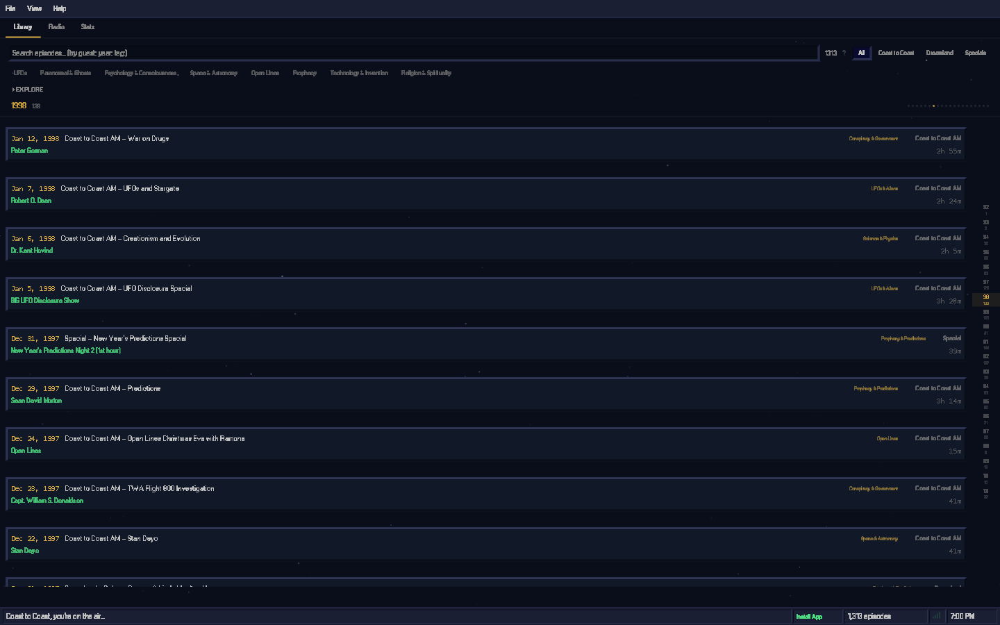
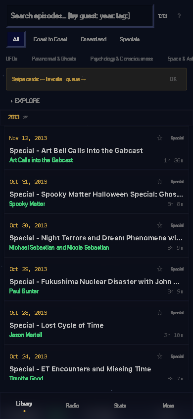

# High Desert

A desktop-grade web player for the Art Bell radio archive — late-night talk radio about UFOs, the paranormal, and the unexplained, broadcasting from the high desert of Pahrump, Nevada.

**Live at [highdesert.space](https://highdesert.space)**

<p align="center">
  
</p>
<p align="center">
  
</p>

## Features

- **Windows 98 dark UI** — raised/inset bevels, title bars, context menus, and a system tray
- **Glassmorphism on mobile** — frosted surfaces over an animated starfield
- **Archive.org streaming** — browse and play thousands of episodes directly
- **AI categorization** — Claude-powered topic extraction, series detection, and guest identification
- **Oscilloscope visualizer** — real-time Web Audio waveform in the player
- **Keyboard navigation** — Space, arrows, N/P, M, / for search, ? for shortcut help
- **Ratings & tags** — 5-star ratings with tag-based filtering
- **Full-text search** — instant search across titles, guests, and descriptions
- **Offline-first** — IndexedDB via Dexie with OPFS audio caching
- **Deep links** — share episodes via `?episode=ID`

## Tech Stack

- **Next.js 16** (App Router) + **React 19**
- **Tailwind CSS 4** with custom Win98 design tokens
- **Dexie** (IndexedDB) for client-side storage
- **Zustand** for player/UI state
- **Web Audio API** for the oscilloscope
- **Anthropic Claude** for AI features

## Getting Started

```bash
git clone https://github.com/jacksongoode/High-Desert.git
cd High-Desert
npm install
cp .env.example .env.local   # add your API keys
npm run dev
```

Open [http://localhost:3000](http://localhost:3000).

## Environment Variables

| Variable | Required | Description |
|---|---|---|
| `ANTHROPIC_API_KEY` | For AI features | Anthropic Claude — episode categorization and analysis |
| `ADMIN_API_TOKEN` | For AI features | Shared secret authorizing `/api/categorize` requests |
| `NEXT_PUBLIC_ADMIN_TOKEN` | For AI features | Client-side token (must match `ADMIN_API_TOKEN`) |

All keys are optional. The app works fully without them — AI categorization just won't be available.

## Scripts

```bash
npm run dev       # Start dev server
npm run build     # Production build
npm run start     # Start production server
npm run lint      # ESLint
```
