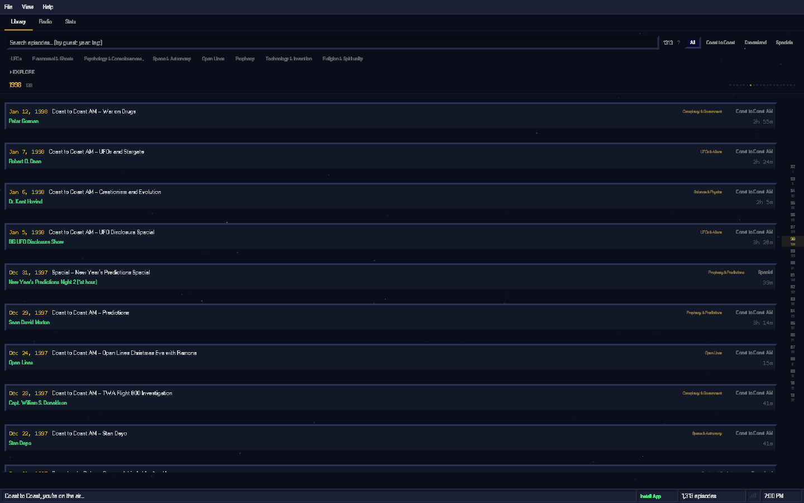
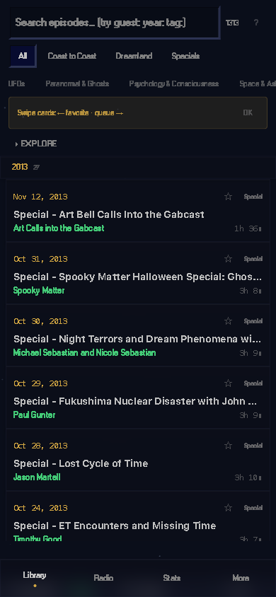

# High Desert

A desktop-grade web player for the Art Bell radio archive — late-night talk radio about UFOs, the paranormal, and the unexplained, broadcasting from the high desert of Pahrump, Nevada.

**Live at [highdesert.space](https://highdesert.space)**

<p align="center">
  
</p>
<p align="center">
  
</p>

## Features

- **Windows 98 dark UI** — raised/inset bevels, title bars, context menus, and a system tray
- **Glassmorphism on mobile** — frosted surfaces over an animated starfield
- **Archive.org streaming** — browse and play thousands of episodes directly
- **Radio dial** — tune through the archive on a frequency strip, with scanning and signal meter
- **Community stats** — play counts, ratings, a leaderboard, and a live listener count
- **AI-enriched catalog** — summaries, tags, categories and series detection, generated offline
- **PWA / offline** — installable, with a service worker and OPFS audio caching
- **Oscilloscope visualizer** — real-time Web Audio waveform in the player
- **Keyboard navigation** — Space, arrows, N/P, M, / for search, ? for shortcut help
- **Ratings & tags** — 5-star ratings with tag-based filtering
- **Full-text search** — instant search across titles, guests, and descriptions
- **Offline-first** — IndexedDB via Dexie with OPFS audio caching
- **Deep links** — share episodes via `?episode=ID`

## Tech Stack

- **Next.js 16** (App Router) + **React 19**
- **Tailwind CSS 4** with custom Win98 design tokens
- **Dexie** (IndexedDB) for client-side storage
- **Zustand** for player/UI state
- **Web Audio API** for the oscilloscope
- **Postgres** for community stats (self-hosted; the app runs fine without it)

## Getting Started

```bash
git clone https://github.com/jacksongoode/High-Desert.git
cd High-Desert
npm install
cp .env.example .env.local   # optional — see below
npm run dev
```

Open [http://localhost:3000](http://localhost:3000).

## Environment Variables

| Variable | Required | Description |
|---|---|---|
| `DATABASE_URL` | For community stats | Postgres connection string. Without it, `/api/stats/*` returns 503 |

`DATABASE_URL` is optional for development. Without it the player, library, radio, search and
offline features all work normally; only the community figures (play counts, ratings,
leaderboard, active listeners) show as empty.

There is no AI API key. Categorization runs offline via `scripts/categorize-library.py`, and its
output is committed to `public/seed/library.json` — nothing is sent to a third party at runtime.

## Scripts

```bash
npm run dev        # Start dev server
npm run build      # Production build
npm run start      # Start production server
npm run lint       # ESLint
npm run typecheck  # tsc --noEmit
npm run test       # Vitest
```
