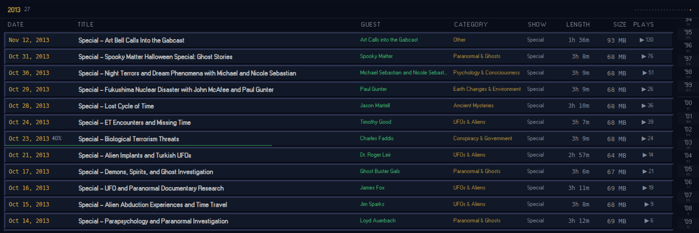
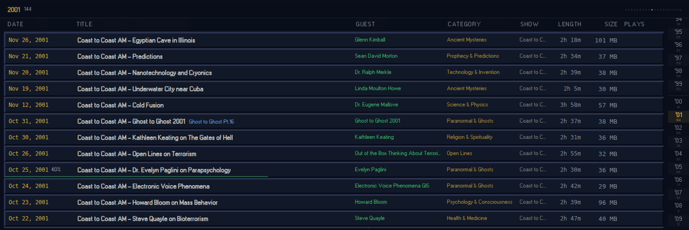

# The library's year rail runs against the list

> User report: "the scroll direction and the timeline rail on the right run opposite ways" (/library).

Reproduced on production (`http://127.0.0.1:3003`, commit `fc2cabb`, which is this branch's
app code) on 2026-09-21 with headless Chromium, at 1440×900 and 390×844 (`isMobile`,
`hasTouch`). Every screenshot and number below comes from
[`timeline-rail/capture.mjs`](timeline-rail/capture.mjs); the raw measurements are in
[`timeline-rail/results.json`](timeline-rail/results.json). Re-run it with
`node docs/timeline-rail/capture.mjs [base-url]`.

**Test profile.** A fresh browser seeds 1,312 episodes with no listening history, which makes
Recent / Top Rated / Most Played identical to Date and In Progress empty. So the capture gives
the profile a deterministic "returning listener" history first: every 29th episode (46 of them)
gets a `lastPlayedAt`, a `playCount` and a `rating`, and every third of those a 40%
`playbackPosition` (16 in progress). The milestone dialog those hours would trigger is marked
seen so it does not cover the list.

**Sort modes.** `SortMode` (`src/app/(desktop)/library/page.tsx:40`) is `date | name | guest |
recent | progress | rated | played`. **There is no ascending date sort**: "date" is Dexie's
`orderBy("airDate").reverse()` (`page.tsx:192-195`, commented at `:501`), and the mobile menu
labels it "Date — newest first". The only oldest-first listing the app ever produces is a
**series filter**, which sorts by part number, then `airDate` ascending (`page.tsx:471-477`);
it is included below as the ascending-date case, using *Ghost to Ghost* (22 episodes over 15
years). The rail is hidden below 768px, so the 390 rows describe the list and the sticky year
header (the only year readout on mobile), which shares the rail's `currentYear`.

## What happens

"Moves" is the active rail button's `getBoundingClientRect().top` sampled at 0, 25, 50, 75 and
100% of the list's scroll range. "Lag" compares the year the rail/header shows with the year of
the first row actually in view (`floor(scrollTop / rowHeight)`).

| Mode | Viewport | Rows | List runs (top → bottom) | Rail runs (top → bottom) | Rail shown | Indicator when scrolling down | Lags? |
|---|---|---|---|---|---|---|---|
| Date | 1440 | 1312 | newest → oldest, 20 year groups `'13 '10 … '93 '92` | oldest → newest `'92 … '13` | yes | **moves UP** (`'13`@877px → `'04`@676 → `'01`@595 → `'97`@476 → `'94`@394) | yes, 5 rows: at 50% first visible row is 2000, rail says `'01` |
| Date | 390 | 1312 | newest → oldest, 20 groups | (in DOM `'92 … '13`, `display:none`) | **no** | n/a — header year goes 2013 → 2004 → 2000 → 1997 → 1994 | yes, 5 cards (580px ≈ most of a phone screen) |
| Date, oldest first (series filter) | 1440 | 22 | oldest → newest, 15 groups `'93 … '10` | oldest → newest `'93 … '10` — **matches** | yes | **does not move** — stuck on `'93`@300px at every position | yes: rail `'93` while visible row reaches 1996; with ≤27 rows the first *rendered* row is always row 0 |
| Date, oldest first (series filter) | 390 | 22 | oldest → newest, 15 groups | (hidden) | **no** | n/a — header 1993 → 1993 → 1996 → 1998 → 2000 | yes, 4–5 cards (visible 2004 while header says 2000) |
| Name | 1440 | 1312 | A→Z by title; 1,096 year runs (years scattered) | `'92 … '13` | yes | **jumps both ways** (608 → 489 → 489 → 772 → 663px) | yes, 5 rows (at 100%: visible 2013, rail `'03`) |
| Name | 390 | 1312 | A→Z, 1,096 year runs | (hidden) | **no** | n/a — header jumps 2001/2005/1997/2004/2013 | yes, 5 cards |
| Guest | 1440 | 1312 | A→Z by guest, then date asc; 962 year runs | `'92 … '13` | yes | **jumps both ways** (608 → 745 → 636 → 717 → 663px) | yes, 5 rows (at 25%: visible 2001, rail `'06`) |
| Guest | 390 | 1312 | 962 year runs | (hidden) | **no** | n/a — header jumps | yes, 5 cards |
| Recently Played | 1440 | 1312 | 46 played shows by `lastPlayedAt` (their years scattered), then the rest newest → oldest; 35 runs | `'92 … '13` | yes | first jumps (top row is a 1992 show → `'92`@355), then **moves UP** (692 → 610 → 491 → 410) | yes, 5 rows at year boundaries |
| Recently Played | 390 | 1312 | same, 35 runs | (hidden) | **no** | n/a | yes, 5 cards |
| In Progress | 1440 | 16 | by `lastPlayedAt`; 13 runs, happens to start oldest (`'92 '95 '96 …`) | 13 years `'92 … '13` | yes | **does not move** — stuck on `'92`@451px | yes: visible row reaches 1997 while rail says `'92` (all 16 rows render, so row 0 is always "first") |
| In Progress | 390 | 16 | same | (hidden) | **no** | n/a — header 1992 → 1992 → 1995 → 1997 → 1999 | yes, up to 5 cards (visible 2004, header 1999) |
| Top Rated | 1440 | 1312 | rating desc, ties newest → oldest; 64 runs | `'92 … '13` | yes | top `'07`, then **moves UP** (774 → 692 → 610 → 491 → 410) | yes, 5 rows at boundaries |
| Top Rated | 390 | 1312 | same, 64 runs | (hidden) | **no** | n/a | yes, 5 cards |
| Most Played | 1440 | 1312 | local `playCount` desc, ties in date order; 65 runs | `'92 … '13` | yes | top `'06`, then **moves UP** (747 → 692 → 610 → 491 → 410) | yes, 5 rows at boundaries |
| Most Played | 390 | 1312 | same, 65 runs | (hidden) | **no** | n/a | yes, 5 cards |

In short: the rail is **always ascending** and the list is **descending in every mode that
has a date order at all** — so in the default view the indicator travels up the rail while
the list scrolls down, which is exactly the report. In Name/Guest the rail cannot mean anything
(the list is not grouped by year), and the indicator hops around. The one ascending listing
(series filter) matches the rail's direction by accident, and there the 5-row lag is so large
relative to the list that the indicator never moves. The rail and its active state exist on
mobile in the DOM but are never shown.

The desktop header's year dots (`TimelineView.tsx:165-179`) have the same fault sideways:
sorted ascending left → right while the list runs newest first.

### Screenshots

Top of the list, then scrolled to 40% (`*-scrolled.png`). The rail is the narrow column at the
right edge on desktop; the amber cell is the active year.

| Mode | 1440 top | 1440 scrolled | 390 top | 390 scrolled |
|---|---|---|---|---|
| Date | [top](timeline-rail/desktop-date-top.png) | [scrolled](timeline-rail/desktop-date-scrolled.png) | [top](timeline-rail/mobile-date-top.png) | [scrolled](timeline-rail/mobile-date-scrolled.png) |
| Series (oldest first) | [top](timeline-rail/desktop-series-top.png) | [scrolled](timeline-rail/desktop-series-scrolled.png) | [top](timeline-rail/mobile-series-top.png) | [scrolled](timeline-rail/mobile-series-scrolled.png) |
| Name | [top](timeline-rail/desktop-name-top.png) | [scrolled](timeline-rail/desktop-name-scrolled.png) | [top](timeline-rail/mobile-name-top.png) | [scrolled](timeline-rail/mobile-name-scrolled.png) |
| Guest | [top](timeline-rail/desktop-guest-top.png) | [scrolled](timeline-rail/desktop-guest-scrolled.png) | [top](timeline-rail/mobile-guest-top.png) | [scrolled](timeline-rail/mobile-guest-scrolled.png) |
| Recently Played | [top](timeline-rail/desktop-recent-top.png) | [scrolled](timeline-rail/desktop-recent-scrolled.png) | [top](timeline-rail/mobile-recent-top.png) | [scrolled](timeline-rail/mobile-recent-scrolled.png) |
| In Progress | [top](timeline-rail/desktop-progress-top.png) | [scrolled](timeline-rail/desktop-progress-scrolled.png) | [top](timeline-rail/mobile-progress-top.png) | [scrolled](timeline-rail/mobile-progress-scrolled.png) |
| Top Rated | [top](timeline-rail/desktop-rated-top.png) | [scrolled](timeline-rail/desktop-rated-scrolled.png) | [top](timeline-rail/mobile-rated-top.png) | [scrolled](timeline-rail/mobile-rated-scrolled.png) |
| Most Played | [top](timeline-rail/desktop-played-top.png) | [scrolled](timeline-rail/desktop-played-scrolled.png) | [top](timeline-rail/mobile-played-top.png) | [scrolled](timeline-rail/mobile-played-scrolled.png) |

Default view, top — list starts at 2013, the active cell is at the *bottom* of the rail:

Default view, scrolled down — list is in 2001, the active cell has climbed *up* the rail:

## Cause

1. **The rail sorts its own years ascending, independent of the list.**
   `TimelineView.tsx:87-91` builds `sortedYears` from a year → count map and sorts it with
   `a.localeCompare(b)`. The list it sits beside is `episodes` in whatever order the page
   produced (`page.tsx:470-502`; "date" is `airDate` **desc**, `page.tsx:193`). Nothing ties the
   two orders together, so in the default mode they are exact mirror images. The header dots
   repeat the ascending sort (`TimelineView.tsx:166-168`).
2. **The rail is derived from counts, not from the rendered sequence.** Because `yearCounts`
   (`TimelineView.tsx:78-85`) is a histogram, it has no notion of *where* in the list a year
   is. In Name/Guest modes a year occurs in hundreds of places; the rail still lists 20 years,
   `handleYearClick` scrolls to the *first* occurrence (`TimelineView.tsx:93-98`), and the
   highlight follows whichever year the top row happens to have.
3. **The active year is read from the first *rendered* row, which is an overscan row.**
   `currentYear` takes `virtualItems[0]` (`TimelineView.tsx:71-75`). `useVirtualList` starts
   the window `overscan` rows above the viewport — `Math.floor(scrollTop / itemHeight) -
   overscan` (`useVirtualList.ts:61`) with `overscan: 5` (`TimelineView.tsx:55`). So the rail
   and the sticky header report the year of the row five rows *above* the top of the screen:
   five 34px rows on desktop, five 116px cards (≈580px) on mobile. In a short list (≤ viewport
   + 5 rows) the first rendered row is always row 0, so the indicator never moves (HD-035).
4. **The rail is never shown below `md`.** `YearNavigator.tsx:18` is `hidden md:flex`; the
   component still renders and still computes `currentYear` on mobile.
5. The rail's direction is not decided per mode either: `TimelineView` renders it whenever the
   list spans more than one year (`TimelineView.tsx:239-245`) and knows nothing about
   `sortMode`, which lives in the page (`page.tsx:57`).

## What the fix must guarantee

- **The rail is a projection of the rendered, sorted array.** Its entries are the year runs of
  `episodes` in the order they appear (consecutive rows of the same year form one entry), not a
  separately sorted set of years. Whatever order the page sorts into, the rail follows for free,
  and any future sort (including an oldest-first date sort, which does not exist today) needs no
  rail change.
- **Top of the rail = top of the list, in every mode.** Newest-first date → newest year at the
  top of the rail; oldest-first → oldest at the top. In modes whose list is not grouped by year
  (Name, Guest — hundreds of runs), the rail must not pretend otherwise: hide it, or project a
  grouping the list actually has.
- **Scrolling the list down moves the indicator down** (its y increases, or stays), never up.
- **The indicator tracks the first visible, non-overscan row** — `floor(scrollTop /
  itemHeight)` — not `virtualItems[0]`. The sticky header year uses the same row.
- **Clicking a rail entry scrolls to the start of that run**, so the entry it lands on is the
  one that becomes active.
- **Mobile:** decide deliberately whether a rail is shown at 390; the e2e spec currently
  expects it to be (see `e2e/library-rail.spec.ts`). If the decision is "no rail on mobile",
  change those two mobile tests to assert the header year instead, rather than deleting them.

These are encoded in `e2e/library-rail.spec.ts`; the cases that fail on current code are marked
`test.fail()` with "fixed in Step 3 (rail is a projection of the list)".
